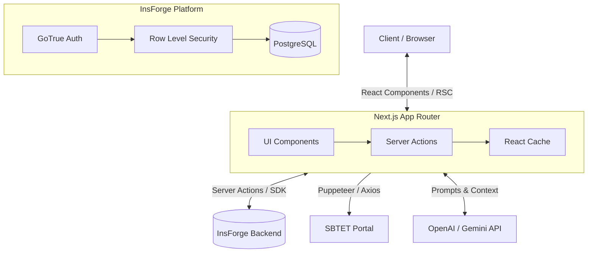

# System Architecture

DiplomaIQ utilizes a decoupled, modern serverless architecture.

## High-Level Architecture Diagram

## Component Breakdown

1. **Next.js (App Router):** Handles routing, rendering (SSR/CSR), and secure backend communication via Server Actions.
2. **React Cache:** Used within `getStudentContext()` to deduplicate database queries during a single request lifecycle, drastically improving performance.
3. **InsForge:** Provides secure JWT-based authentication and a managed PostgreSQL database protected by Row Level Security (RLS) policies.
4. **AI Layer:** Converts deterministic DB queries (like weak subjects or ECET cutoffs) into human-readable strategies and explanations without hallucinating facts.
