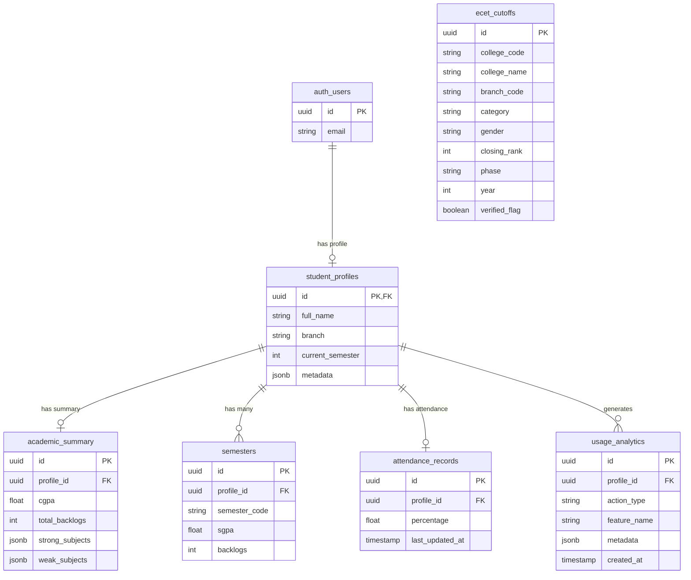

# Database Schema (ER Diagram)

The underlying PostgreSQL database is hosted on InsForge and enforces strict relational integrity.

## Entity-Relationship Diagram

## Security Posture
All tables (except read-only public tables like `ecet_cutoffs`) have **Row Level Security (RLS)** enabled, ensuring users can only `SELECT`, `INSERT`, or `UPDATE` rows where `profile_id = auth.uid()`.
